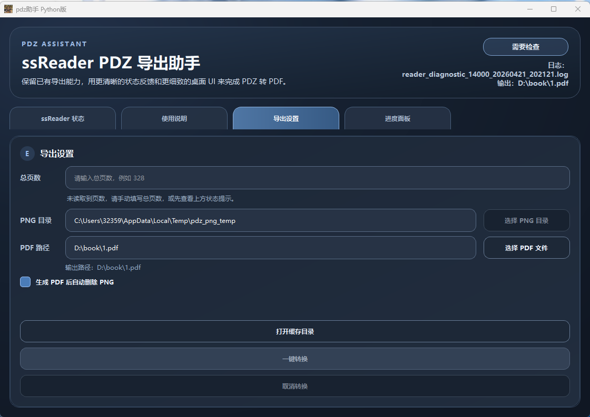

# pdz-pdf

`pdz-pdf` is a Windows desktop tool that helps export PDZ reading content from `ssReader` into PDF.

This repository is the Python desktop rewrite of the original `pdz-assistant` idea. It keeps the original workflow, but moves the implementation to a Python + PySide6 application that is easier to maintain, package, and publish as a standalone executable.

## Screenshot



## Features

- detect `ssReader.exe` status automatically
- read total page count from process memory when available
- allow manual page count input when automatic detection fails
- collect rendered page images from `%LOCALAPPDATA%\Temp\buffer`
- convert cached images into PNG and merge them into PDF
- provide a desktop UI for export settings, progress tracking, and diagnostics
- support packaging into a portable Windows executable

## How It Works

The application follows this workflow:

1. Open a `.pdz` file in `ssReader`.
2. Enter the reading view and keep the window in a stable state.
3. The tool detects reader state and tries to read total pages.
4. It collects page images from the local buffer directory.
5. It exports the pages into a PDF file.

## Requirements

- Windows
- `ssReader.exe`
- Python 3.11 environment for source execution

Python dependencies used by this project:

- `PySide6`
- `Pillow`
- `PyMuPDF`
- `pymem`
- `pywin32`
- `psutil`

## Run From Source

If you want to run the Python source version directly:

```powershell
conda activate D:\Downloads\pdz-assistant-1.2\pdz-assistant-1.2\.conda-env
python .\main.py
```

Or install dependencies manually and run:

```powershell
pip install -r ..\requirements.txt
python .\main.py
```

## Build a Portable Executable

This repository includes packaging scripts for a portable Windows build:

- `build_portable.ps1`
- `freeze_standalone.py`

The application icon is currently based on `Gemini.ico`.

## Recommended GitHub Metadata

Repository name:

- `pdz-pdf`

Suggested description:

`Convert PDZ reading output from ssReader into PDF with a Python desktop tool for Windows.`

Suggested topics:

- `pdz`
- `pdf`
- `ssreader`
- `python`
- `windows`
- `desktop-tool`

## Project Origin

This project references the original idea and export workflow from:

- upstream project: `PettterWang/pdz-assistant`
- upstream URL: `https://github.com/PettterWang/pdz-assistant`

This repository is a Python rewrite and adaptation. If you publish or redistribute it, keep the origin attribution visible in the repository homepage and release notes.

## Open Source Publishing Notes

Before publishing this repository publicly, it is recommended to confirm:

- whether the upstream project license allows republishing, porting, or redistribution
- whether the included icon, screenshots, and demo assets are safe to redistribute
- whether any generated binaries or packaged runtimes should be excluded from source control

No explicit upstream `LICENSE` file has been confirmed from the local snapshot used here, so please verify licensing before choosing a license for this repository.

## Repository Structure

- `main.py`: application entry point
- `pdz_assistant/app.py`: main desktop UI
- `pdz_assistant/reader.py`: ssReader detection and state inspection
- `pdz_assistant/exporter.py`: export workflow

## License Recommendation

If the upstream project clearly allows reuse under a permissive license, you can choose a standard open source license such as MIT.

If the upstream project has no license or the reuse status is unclear, do not add a new permissive license yet. In that case, first confirm authorization or upstream licensing and then publish.
